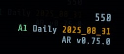

# Autogen Rundown 🎲

<!--
* Can we have boosters generate progression for us

JQ Commands for checking blocks:

Check Alarm Persistent IDs for levellayout

  jq -r '.Blocks | map(select(.name | test("^[0-9]+_B1")) | {name, zones: .Zones | map({ChainedPuzzleToEnter})})' build/34855/GameData_LevelLayoutDataBlock_bin.json

TODO:
  * Use Zone Prefix Override to alert to specific tiles.
  * Enable unit tests again after fixing chained puzzles.

Seed: 201
* D3, Main bulkhead door spawned with secret tank and it looks buggy.
  Showed stealth door

Probably need to rework enemy sleeper spawning now with level planner

Seed: 2024_07_14
* D2: Error alarm turnoff in 775 does not unlock

Seed: 2024_07_08
* Check the local progression mod
* Boosters confirmed not working for modded rundowns
* Reduce chance of nightmare scout spawning on reactor levels. It requires specialized tool
  generally

Seed: 2024_07_07
* Can we change the reactor enemy waves to spawn from one direction?
  * Seems like yes but only if we build right next to the elevator drop.

Seed: 2024_06_27
* Check I-Geo, seems to not be spawning bridge. Maybe a geomorph is missing now?

Seed: 2024_06_25
* Level lockup: E1
-->

Automatic Rundown generation, using procedural seed based generation. A new rundown seed is generated each day. Play with friends with zero configuration.

Levels and rundowns are designed to feel like playing fairly vanilla GTFO. Some custom tiles are used to complete the game for things like Reactor in Floodways.

## Installation

### With Mod Manager

Go to the Autogen Rundown Thunderstore mod page (https://gtfo.thunderstore.io/package/the_tavern/AutogenRundown/) and install via your mod manager.

### Manual Installation 📦
Download the latest version of the mods manual install zip from the [releases page](https://github.com/brgmnn/autogen-rundown/releases/latest).

> [!IMPORTANT]
> Backup your GTFO game folder before copying any mod files in so you can easily restore it

1. Back up your GTFO game folder (`<Steam Location>\steamapps\common\GTFO`)
  * Right click on GTFO in steam, select "properties", select "Installed Files"
  * Click "Browse..." at the top
  * Windows File Explorer will open inside the GTFO game folder. Navigate up one level and copy/paste the folder. Name it appropriately for your backup (eg. `GTFO_backup`).
1. Extract the `Autogen_manual_install_<Version>.zip` archive into a folder. *Do not extract into the game folder*.
2. Move the contents of `AutogenRundown_GTFO` into the GTFO game folder: `<Steam Location>\steamapps\common\GTFO`.
3. Run the game.

If done correctly, after the game launches you should see a watermark in the bottom right corner of the game identifying the mod version and current seed.

#### Uninstalling the mod

To uninstall the mod, open `<Steam Location>\steamapps\common` and delete the GTFO game folder `GTFO`. Then rename your backup GTFO game folder (eg. `GTFO_backup`) to `GTFO`.

If you did not make a backup of the game: delete the GTFO game folder and run "Verify integrity of game files" from the Steam "Installed Files" properties menu. This will redownload the GTFO game folder.

#### Updating to the latest mod version

Follow the installation instructions again, check yes to overwrite all files.

## Features progress

> [!CAUTION]
> Rundown 8 spoilers below!

* Levels
  * [x] A Tier
  * [x] B Tier
  * [x] C Tier
  * [x] D Tier
  * [x] E Tier
  * Additional objectives
    * [x] Secondary
    * [x] Overload
    * [x] Simple Bulkhead key placement
    * [ ] Chained Bulkhead key placement
  * Lights
    * [x] Random lights selection
    * [x] Reactor specific lights
    * [ ] Fog specific lights
    * [ ] Custom lights(?)
  * Zones
    * Custom Geomorphs
      * [x] Hubs
      * [x] I's (corridors)
      * [ ] Warp portals
      * [ ] Rundown 8 Geomorphs
    * Curated event layouts
      * [ ] Class 10+ alarm room
      * [ ] King of the hill room
    * [ ] Specialized bulkhead geomorphs and layouts
    * [ ] Bulkheads behind bulkheads
  * Challenges
    * [x] Key to unlock doors
    * [ ] Cell to power generator to unlock doors
    * [x] Fog
    * [ ] Infectious fog
  * [ ] Dimensions
* Objectives
  * [x] Clear Path — *Navigate through the zones to a separate extraction elevator*
  * [x] Gather Small Items — *IDs, GLPs etc.*
  * [x] HSU Find Sample
  * [x] Reactor Startup
    * [x] Fetch codes from terminals
  * [x] Reactor Shutdown
  * [x] Input Special Terminal Command
  * [x] Retrieve Big Items — *Fog Turbine etc.*
  * [x] Power Cell Distribution — *Distributing cells to individual generators*
  * [x] Terminal Uplink
  * [x] ~~Central Generator Cluster~~ — *Fetching cells for a central generator cluster*. **Unreliable cluster spawns**
  * [ ] HSU Activate Small - *Bring Neonate to depressurizer*
  * [x] Survival - *Timed survival*
  * [ ] Gather Terminal
  * [ ] Corrupted Terminal Uplink
  * [x] Timed Terminal Sequence
* Enemies
  * [x] Basic hybernation
  * [x] Event based activation
  * Types of enemies present
    * [x] Strikers / Shooters
    * [x] Giants
    * [x] Chargers
    * [x] Shadows
    * [x] Beserkers
    * [x] Hybrids
    * [x] Scouts
      * [x] Regular
      * [x] Zoomer
      * [x] Shadow
      * [x] Charger
      * [x] Beserker
    * [-] Mothers
      * [x] Mother
      * [x] P-Mother
      * [ ] Nightmare Mother
    * [-] Tanks
      * [x] Tank
      * [ ] Immortal Tank
      * [x] Potato Tank
    * [x] Pouncers (Snatchers)
  * Custom enemy spawning
    * [ ] Balanced default spawns (in progress)
    * [x] Charger only zones
    * [x] Shadow only zones
    * [ ] Beserker only zones
* Alarms
  * [x] Basic alarms
  * [x] Blood doors
  * [x] Error alarms
  * [x] S-Class alarms
  * [x] Surge alarms
  * [x] High class alarms (> Class V)
* Glowsticks — *All colors available to spawn*
  * [x] Green (normal)
  * [x] Yellow
  * [x] Halloween (orange)
  * [x] Christmas (red)
