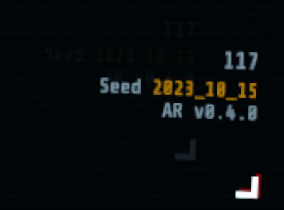

# Autogen Rundown 🎲


<!--
* Can we have boosters generate progression for us

JQ Commands for checking blocks:

Check Alarm Persistent IDs for levellayout

  jq -r '.Blocks | map(select(.name | test("^[0-9]+_B1")) | {name, zones: .Zones | map({ChainedPuzzleToEnter})})' build/34855/GameData_LevelLayoutDataBlock_bin.json


TODO:
  * Use https://thunderstore.io/c/gtfo/p/randomguy0753/ZoneScan/ for full room scanning
  * Make extract scan short if there's no extract alarm (Don't do it just based on level tier)
  * Add a way to automatically install deps?
  * GIGA Infection Hybrid blood door might be _too_ much, it's like 12 hybrids
  * Objective: Distribute Power Cells
    * Needs something to happen when completing all the cells ideally
    * Would be good if the fog could rise or lower when inserting the cells
  * Add more disinfection options for infection levels and hybrids
  * Add more variety on fog for vibes
  * Uplink objectives stop ALL WAVES after completing them. Got to figure out a way to not do that.
  * Retrieve big item:
    * A-tier main only rolled no exit alarm.
  * Add "Assets/AssetPrefabs/Complex/Service/Geomorphs/Maintenance/geo_64x64_service_floodways_hub_AW_01.prefab", the giant HSU pit. Technically an I-tile
  * Add support for text data block mergers. It should be relatively safe to do this even with overwrites
  * Make E-tier shorter but harder. E4 Seasonal extreme has too many extra zones
  * Shorter (or longer?) warden protocol startup times?
    * Maybe even a bait one?
  * Slightly longer time needed on D-tier reactor
  * Extract decryption keys far too easy on D-tier overload
    * Needs extract or finish objective modifier
  * Might consider if we even need an error alarm turnoff for levels in main where it goes all the way to the end?
  * VERY SLIGHT increase in Apex alarm wave pops
  * No sound playing for clients
  * Investigate some kind of grace period for scans coming back on
  * Check if I broke something with uplinks where host and client get desynced for where an uplink is. We had it where host didn't get the verify coming through
  * Increase exclusion zone around elevator for security scans
  * E-tier had gather 3 samples
  * E-tier valiant way too easy
    * enemies get bugged
  * Have a challenge like halfway through the fog starts rising and you can turn off the fog in a zone
  * Make generator distribution objective MAIN always have 2 or more generator cells
  * `GatherSmallItems` should probably not have error alarm on picking up the "last" objective item. Instead we should have it be done by the zones they have to open
  * Generator Cluster needs cells to be tightened up in their spawns
  * Big security scans that move are too hard
  * Fix uplink text for case where there's one terminal

  * See if we can fix enemies not navigating through the final door in D3

  * Seems that Valiant objectives fail a lot

  * Distribute power cells is _really_ short on main only missions now


  * Fix the cycling of security scans having global sound! Really annoying right now
  * Tone down higher density of scans, especially for moving ones

  * Add a version of travel scan where lights go out but only lights by the scan are lit up
  * Add a version of the scan wanted distance that takes a negative number which then finds a point thats a proportion of the total area away from the previous scan

  * Check SC1: Seemed like no enemies after doing secondary?

TODO for 1.0
  New Objectives!
    * Alpha / static dimension objective with portal / matter wave projector / something big in the dimension
    * Cryptomnesia objective main, recreate R6D4

NOTE
  * Cryptomnesia - GatherSmallItems only 1 objective in 42 uses the dimensions for cryptomensia for it


Idea:
  * Secondary survival that procs on door open
  * Side quest room to lower the fog
  * Bring big pickup for scan on door
  * Add full team scan on extract instead of warden scan
  * R8E2 "ADMIN_TEMP_OVERRIDE" command level
    * Keep putting in command to keep surge error at bay
  * Clear path to a warp portal that jumps you to the success screen
  * Add bonus terminals in reactor zones

# Datasphere color pack
https://thunderstore.io/c/gtfo/p/ProjectZaero/Data_Sphere_Flavor_Pack/

# Geo pack ideas
https://thunderstore.io/c/gtfo/p/TheDoggyDoge/DogsTilePack/
https://thunderstore.io/c/gtfo/p/xiaoyao/XAOYAO_developer_package/


Weekly missing geo seed B1:
    2025_11_05

Monthly missing nav mesh A1:
    2025_10


E-tier analysis

* R2E1 - Crib
* R4E1 - Downwards
* R5E1 - KDS Deep
* R7E1 - Chaos
* R8E1 - Valiant
* R8E2 - Release


Requests:
  * Add support for VanillaReloaded mod
    * https://discord.com/channels/782438773690597389/1342735255009755227/1373594263019061281

Check: https://discord.com/channels/782438773690597389/783918553626836992/1407457297889890530


Problems:
  - Assets/AssetPrefabs/Complex/Mining/Geomorphs/geo_64x64_mining_portal_HA_01.prefab
    - Has some innacessible spawn locations where boxes and big pickups can spawn.
      - Item spawn fix resolves this?
    - There are two side flanges next to the entry door for the portal room which are blocked but still marked as spawn locations


2025_08_31
  * Seasonal Fall_2025 - A4 Decaying Banishment: Pretty much perfect short A level. 26 mins, 5 zones, straight forward clear path
    * Maybe too high scan levels? 2 class 5 and 2 class 3

2025_08_27
  * Generator cluster needs a little less zones

2025_08_17
  * Reduce number of gather so we have to do all objectives
  * Why does D2 only have onion shooters on first alarm door in extreme

2025_04_29
  * D1: Error alarm with no turn off is quite a bit harder
    * Probably we need a few less alarms
    * Might want to have fewer enemies on reactor fetch code tiles
    * D1 had A LOT of zones to run through, may want to not have multiple zones of fetch codes and do single zone fetch codes
    * For fetch codes that have zones not starting at reactor, need to factor traverse time to get there and back
  * D1 (or D2?)
    * Need to fix the zone count for layout for reactors
      * Maybe consider using a different layout for it?
    * Consider if we reduce number of fetch codes from 6 to 5
    * May need to BUFF the reactor waves a little

Weekly 9-A1 bug:
  * Doesn't seem to be the chained puzzles.. Unclear for now
  * Disappears if I disable EITHER overload or secondary
  * It appears to be the map layout. I suspect it's the door not having a place to place though

Exit Geo failures to spawn:
  * Assets/Bundles/RLC_Mining/geo_64x64_mining_storage_exit_hub_RLC_01.prefab
  * Assets/geo_64x64_dig_site_exit_dak_01.prefab
Working exit geos
  * Assets/Prefabs/Geomorph/Mining/geo_storage_FA_dead_end_01.prefab

  Note: It may well be a space issue. The two failed tiles are quite large, so when they don't spawn it might just be that there isn't space for them.

Monthly April
  * Find HSU seems like it needs re-rolling occasionally. May be some of the levels can't place well
  * Need to take another look at balance for reactor shutdown. D/E looks to either be way too hard or way too easy.
  [ ] Check if we can use a mod like https://thunderstore.io/c/gtfo/p/W33B/Arsenality/
    * Seems like it adds datablock files directly
  * Try using fixed bioscan points for room wide scans?
  [ ] C4 - Security sensors spawn LOADS of snatchers
  [ ] E1 - Maybe a bit too easy?
  [ ] D1 - Activate small HSU doesn't require the objective to exit
      - Can we exclude double mother / double tank from first zone

Monthly Feb
  * Double cargo B1 -- Not sure why?
  * Reactor D2
    [ ] Mother wave had good amount of time. DONT CHANGE

Missing tiles to add
  * Add R8A1 garden hub tile to hubs

Remove intel in elevator drop that shows:
  "Artifact Heat at"
Maybe replace with number of logs?

Enemies:
  A:
    * Baseline
  B:
    * Baseline
  C:
    * Baseline
    * Chargers
    * Nightmares
  D:
    * Baseline
    * Chargers
    * Shadows
    * Nightmares
  E:
    * Baseline
    * Chargers
    * Shadows
    * Nightmares

-->

Automatic Rundown generation, using procedural seed based generation. Four active rundowns to choose from: the daily, weekly, monthly, and each season. Play with friends with zero configuration of seeds.

- [Installation](#installation)
- [Base game features](#base-game-features)
- [Additional vanilla-like features](#additional-vanilla-like-features)
- [3rd Party Mod Support](#3rd-party-mod-support)


Track your progression in each rundown separately from the base game and other modded rundowns, see if you can clear them "Unaugmented"! (Without boosters)


Levels and rundowns are designed to be similar and in the spirit of vanilla GTFO. The largest difference is in the addition of new tilesets (geomorphs) to add more variety to the existing games set of tiles.

## Installation

<!-- ### With Mod Manager -->

Go to the Autogen Rundown Thunderstore mod page (https://gtfo.thunderstore.io/package/the_tavern/AutogenRundown/) and install via your mod manager.

To check if the installation is successful, after the game launches you should see a watermark in the bottom right corner of the game identifying the mod version `AR <version>`. If you further select a level from one of the rundowns you should also see a watermark identifying the leve, the rundown, and the seed used for that rundown.



> [!CAUTION]
> GTFO game and mod spoilers below!

## Base game features

- Levels
  - [x] A Tier
  - [x] B Tier
  - [x] C Tier
  - [x] D Tier
  - [x] E Tier
  - Additional objectives
    - [x] Secondary
    - [x] Overload
  - Lights
    - [x] Random lights selection
    - [x] Reactor specific lights
    - [ ] Fog specific lights
    - [x] Custom lights(?)
  - Zones
    - Custom Geomorphs
      - [x] Hubs
      - [x] I's (corridors)
      - [ ] Warp portals
      - [x] Rundown 8 Geomorphs
    - Curated event layouts
      - [x] Class 10+ alarm room
      - [x] King of the hill room
    - [x] Specialized bulkhead geomorphs and layouts
    - [x] Bulkheads behind bulkheads
  - Challenges
    - [x] Key to unlock doors
    - [x] Cell to power generator to unlock doors
    - [x] Locked terminals
    - [x] Fog
    - [x] Infectious fog
    - [x] Security Sensors
  - [ ] Dimensions
- Objectives
  - [x] Clear Path — _Navigate through the zones to a separate extraction elevator_
  - [x] Gather Small Items — _IDs, GLPs etc._
  - [x] HSU Find Sample
  - [x] Reactor Startup
    - [x] Fetch codes from terminals
  - [x] Reactor Shutdown
  - [x] Input Special Terminal Command
  - [x] Retrieve Big Items — _Fog Turbine etc._
  - [x] Power Cell Distribution — _Distributing cells to individual generators_
  - [x] Terminal Uplink
  - [x] Central Generator Cluster — _Fetching cells for a central generator cluster_
  - [x] HSU Activate Small - _Bring Neonate to depressurizer_
  - [x] Survival - _Timed survival_
  - [x] Gather Terminal
  - [x] Corrupted Terminal Uplink
  - [x] Timed Terminal Sequence
- Enemies
  - [x] Basic hybernation
  - [x] Event based activation
  - Types of enemies present
    - [x] Strikers / Shooters
    - [x] Giants
    - [x] Chargers
    - [x] Shadows
    - [x] Beserkers
    - [x] Hybrids
    - [x] Scouts
      - [x] Regular
      - [x] Zoomer
      - [x] Shadow
      - [x] Charger
      - [x] Beserker
    - [x] Mothers
      - [x] Mother
      - [x] P-Mother
      - [x] Nightmare Mother
    - [x] Tanks
      - [x] Tank
      - [ ] Immortal Tank
      - [x] Potato Tank
    - [x] Pouncers (Snatchers)
  - Custom enemy spawning
    - [x] Balanced default spawns (in progress)
    - [x] Charger only zones
    - [x] Shadow only zones
    - [x] Beserker only zones
- Alarms
  - [x] Basic alarms
  - [x] Blood doors
  - [x] Error alarms
  - [x] S-Class alarms
  - [x] Surge alarms
  - [x] High class alarms (> Class V)
- Lore
  - [x] All base game logs can be found on terminals

## Additional vanilla-like features

- Alarms
  - [x] Secret Alarms — _Appear to be free but aren't_
  - [x] Events on/during Alarms — _Alarms can have events such as lights out or fog flood during the alarm_
  - [x] Extreme/Overload Surge Alarms — Surge alarms with chargers / beserkers
- Challenges
  - [x] Reactor terminals can be locked just like regular terminals
  - [x] Secret Reactor Shutdown — _Secret alarm but for the reactor shutdown_
- Cosmetic
  - Glowsticks — _All colors available to spawn_
    - [x] Green (normal)
    - [x] Yellow
    - [x] Halloween (orange)
    - [x] Christmas (red)
    - [x] Player colored glowsticks (client side)
  - Inserting generator cells turns on emergency lights
- Lore
  - Custom Warden intel messages
    - [x] General
    - [ ] Objectives
      - [x] HSU Find Sample
      - [ ] Clear Path
      - [ ] Reactor Startup
      - [ ] Reactor Shutdown
      - [ ] Distribute Power Cells
      - [ ] Central Generator Cluster

## 3rd Party Mod Support

AutogenRundown supports the following 3rd party peer mods. You can install them along side AutogenRundown. Note that several of these mods conflict with each other such as the weapon modification mods.

- [Arsenality](https://thunderstore.io/c/gtfo/p/W33B/Arsenality)
- [ArsenalityRebalance](https://thunderstore.io/c/gtfo/p/leezurli/ArsenalityRebalance)
- [VanillaReloaded](https://thunderstore.io/c/gtfo/p/tru0067/VanillaReloaded)
- [GTFriendlyO](https://thunderstore.io/c/gtfo/p/Carb_Crusaders/GTFriendlyO/)
- [OmegaWeapons](https://thunderstore.io/c/gtfo/p/Mimikium/OmegaWeapons/)

## Customizing Autogen Datablocks

You can override any generated datablock or custom JSON file by placing partial files in the `GameData-Custom` folder in the BepInEx folder for your mod profile. Your changes are merged deeply into the generated datablocks. You only need to specify the properties you want to change. Everything else is preserved.

Custom overrides are applied **last**, after all rundown generation and copied peer mod configuration files.

### Setup

Create the folder:

```
BepInEx/GameData-Custom/
```

This folder mirrors the structure of `BepInEx/GameData/{revision}/`. Place your override files using the same relative paths. For example:

```
BepInEx/
  GameData-Custom/
    GameData_EnemyBalancingDataBlock_bin.json
    GameData_FogSettingsDataBlock_bin.json
    Custom/
      ExtraEnemyCustomization/
        Property.json
```

### Modifying Datablocks (persistentID matching)

Datablock files (`GameData_*DataBlock_bin.json`) contain a `Blocks` array where each block has a `persistentID`. Your override file only needs the blocks you want to change, with only the properties you want to modify.

**Example**: Make Strikers have 999 health and add a custom enemy:

```json
// GameData-Custom/GameData_EnemyBalancingDataBlock_bin.json
{
  "Blocks": [
    { "persistentID": 13, "Health": { "HealthMax": 999 } },
    {
      "persistentID": 50000,
      "name": "Custom",
      "internalEnabled": true,
      "Health": { "HealthMax": 100 }
    }
  ]
}
```

- **Block 13** (Striker): Only `HealthMax` is changed. All other Striker properties (armor, name, etc.) are preserved.
- **Block 50000**: New block, appended to the array since no existing block has this ID.
- `LastPersistentID` is automatically recalculated.

### Modifying Arrays by Index (\_\_index)

For JSON files where array elements don't have a `persistentID` (such as files in `Custom/`), you can target specific array positions using `__index`. The `__index` property is stripped from the final output.

**Example**: Increase Mega-Mother children spawns to 50 max and 20 min in ExtraEnemyCustomization:

```json
// GameData-Custom/Custom/ExtraEnemyCustomization/Ability.json
{
  "BirthingCustom": [
    { "__index": 0, "ChildrenPerBirthMin": 20, "ChildrenMax": 50 }
  ]
}
```

This merges into the object at position 0 of the `BirthingCustom` array, changing `ChildrenPerBirthMin` and `ChildrenMax` while preserving all other properties at that index.

### Appending to Arrays (\_\_existing)

To add items to an array while keeping the original contents, use the `"__existing"` string marker. It expands to the full original array at that position. Items before it are prepended, items after are appended.

**Example**: Append a new enemy to an existing list:

```json
{
  "enemies": ["__existing", { "name": "CustomBoss", "hp": 500 }]
}
```

**Example**: Prepend and append:

```json
{
  "enemies": [{ "name": "First" }, "__existing", { "name": "Last" }]
}
```

If `"__existing"` is omitted, the array is replaced entirely (see below).

### Replacing Arrays

If your override array contains elements **without** `persistentID`, `__index`, or `__existing`, the entire target array is replaced.

```json
{
  "tags": ["new_tag_a", "new_tag_b"]
}
```

### Non-JSON Files

Non-JSON files (images, icons, etc.) are copied directly into the target directory, overwriting any existing file. New files with no matching target are also copied as-is.

### Merge Rules Summary

| Scenario                           | Behavior                                          |
| ---------------------------------- | ------------------------------------------------- |
| Object property exists in both     | Deep-merged recursively                           |
| Object property only in override   | Added                                             |
| Object property only in generated  | Preserved                                         |
| Array elements have `persistentID` | Matched by ID, deep-merged; new IDs appended      |
| Array elements have `__index`      | Merged at specified position; `__index` stripped  |
| Array contains `__existing` marker | Original items placed at marker; new items around |
| Array elements have neither        | Entire array replaced                             |
| Scalar values                      | Override replaces generated                       |
| JSON file with no existing target  | Copied as new file                                |
| Non-JSON file                      | Copied with overwrite                             |

## Acknowledgements

Many thanks to the modding community for making GTFO modding possible, and a special thank you to the following creators for work that this mod depends on:

- Amor's [AmorLib](https://thunderstore.io/c/gtfo/p/Amorously/AmorLib/) and [ExcellentObjectiveSetup](https://thunderstore.io/c/gtfo/p/Amorously/ExcellentObjectiveSetup/)
- Dak's [MTFO](https://thunderstore.io/c/gtfo/p/dakkhuza/MTFO/) and [Geomorph Pack](https://thunderstore.io/c/gtfo/p/dakkhuza/DakGeos/)
- Inas07's [many mods](https://thunderstore.io/c/gtfo/p/Inas07/)
  - Notably [LocalProgression](https://thunderstore.io/c/gtfo/p/Inas07/LocalProgression/) and [ExtraObjectiveSetup](https://thunderstore.io/c/gtfo/p/Inas07/ExtraObjectiveSetup/)
- Flowaria's [Geomorph Pack](https://thunderstore.io/c/gtfo/p/Flowaria/FlowGeos/)
  - Including the fantastic Floodways Reactor tile enables reactor missions in the service Complex.
- donan3967's [Geomorph Pack 1](https://thunderstore.io/c/gtfo/p/donan3967/donan3967_geo_pack_1/) and [Geomorph Pack 2](https://thunderstore.io/c/gtfo/p/donan3967/donan3967_geo_pack_2/)
- Red_Leicester_Cheese's [Geomorph Pack](https://thunderstore.io/c/gtfo/p/Red_Leicester_Cheese/CheeseGeos/)
- SamDB's [SamGeos](https://thunderstore.io/c/gtfo/p/Sam_D_B/SamGeos/) and [SamGeosV2](https://thunderstore.io/c/gtfo/p/Sam_D_B/SamGeosV2/)
